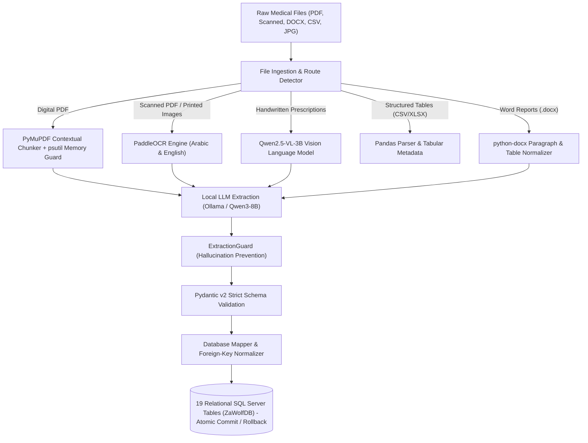

<div align="center">

# 🐺 ZaWolf Medical Document Processing Pipeline
### **Enterprise On-Premise Clinical Document Extraction, Multimodal Vision OCR & Relational SQL Server Persistence**

[](https://python.org)
[](https://microsoft.com/sql-server)
[](https://ollama.com)
[](https://huggingface.co/Qwen)
[](https://github.com/PaddlePaddle/PaddleOCR)
[](https://docs.pydantic.dev)

<br/>


</div>

---

## 🏥 Overview
**ZaWolf** is a production-grade, on-premise clinical data extraction and transactional persistence pipeline engineered by **Eng. Saad Tamer**. It is designed specifically for healthcare organizations, medical clinics, and hospital networks to ingest heterogeneous, unstructured medical records (Digital PDFs, Scanned PDFs, handwritten prescriptions, lab sheets, Word clinical summaries, Excel tables) and reliably transform them into validated relational entities across **19 SQL Server tables** within a single atomic transaction.

---

## 🏛️ System Architecture



---

## ✨ Key Features & Engineering Breakthroughs

* ⚡ **Zero-Data-Leakage On-Premise Execution:** Operates 100% locally with Ollama (`qwen3`) and local HuggingFace transformers (`Qwen2.5-VL-3B`), ensuring strict compliance with patient privacy (HIPAA/GDPR).
* 📑 **Multi-Format Ingestion Engine:**
  * **Digital PDFs:** Contextual chunking with sliding token windows and `psutil` memory usage monitoring.
  * **Scanned PDFs:** Dynamic DPI image rasterization with multi-page batch OCR.
  * **Handwritten Prescriptions:** Deep handwriting deciphering powered by `Qwen2.5-VL-3B-Instruct`.
  * **Office & Tabular Records:** Native parsing for Word (`.docx`), CSV, and Excel (`.xlsx`).
* 🛡️ **ExtractionGuard Anti-Hallucination Barrier:** Strict post-processing layer that zeroes out unmentioned clinical entities, preventing the LLM from fabricating patient names, doctors, or unrelated diagnoses.
* 💾 **Atomic Relational Persistence:** Single-transaction unit-of-work across 19 foreign-key-interlocked tables with complete rollback guarantees on error.

---

## 🗄️ Relational Database Schema (19 Tables)

| Domain | Database Tables |
|---|---|
| **Organizational** | `locations`, `staff` |
| **Patient Profile** | `clients`, `medical_history`, `vitals` |
| **Diagnostics & Labs** | `lab_results`, `treatment_records`, `photos` |
| **Pharmacy & Medications** | `medications`, `products` |
| **Clinical Services & Operations** | `services`, `appointments`, `consents`, `packages`, `client_packages` |
| **Billing & Finance** | `invoices`, `invoice_items`, `payments` |
| **Traceability & Audit** | `source_documents` |

---

## 🚀 Quick Start

### 1. Prerequisites
* Python 3.11+
* Microsoft SQL Server 2019+
* Ollama installed and running (`ollama serve` with `qwen3`)

### 2. Installation
```bash
git clone https://github.com/saadtamer/ZaWolf-Medical-Document-Processing-Pipeline.git
cd ZaWolf-Medical-Document-Processing-Pipeline
python -m venv .venv
source .venv/bin/activate  # On Windows: .venv\Scripts\activate
pip install -r requirements.txt
```

### 3. Run Pipeline
```bash
python main.py --file data/input/sample_prescription.jpg
```

---

<div align="center">
Developed with ❤️ by <b>Eng. Saad Tamer</b> | AI & Data Engineer
</div>
