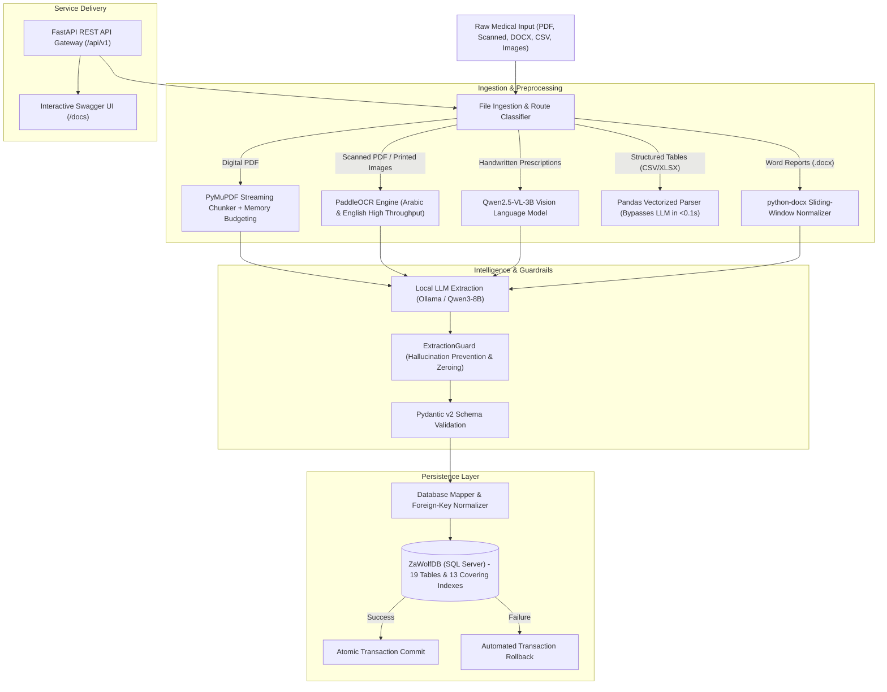

<div align="center">

# 🐺 ZaWolf Medical Document Processing Pipeline
### **Enterprise On-Premise Clinical Document Extraction, Multimodal Vision OCR & Relational SQL Server Persistence**

[](https://python.org)
[](https://fastapi.tiangolo.com)
[](https://microsoft.com/sql-server)
[](https://ollama.com)
[](https://huggingface.co/Qwen)
[](https://github.com/PaddlePaddle/PaddleOCR)
[](https://docs.pydantic.dev)

<br/>


</div>

---

## 🏥 Executive Overview

**ZaWolf** is a production-grade, on-premise clinical document intelligence and transactional persistence system engineered by **Eng. Saad Tamer**. Designed for hospital networks, specialized medical clinics, and healthcare EHR platforms, ZaWolf ingests multi-format unstructured medical records (Digital PDFs, scanned pathology sheets, physician handwritten prescriptions, clinical Word summaries, and tabular CSV/Excel lab sheets) and converts them into validated relational entities across **19 SQL Server tables** under a single atomic transaction.

The system is completely **Hardware-Agnostic**, dynamically scaling to available physical CPU cores, managing socket lifecycles without resource leakage, and operating 100% locally to guarantee strict patient confidentiality (HIPAA / GDPR compliance).

---

## 🏛️ System Architecture



---

## ⚙️ Core Architectural Pillars

### 1. Hardware-Adaptive Threading
Dynamically senses physical host CPU cores via `psutil.cpu_count(logical=False)` and assigns optimal `num_thread` runtime parameters to local LLM instances. Allows seamless deployment from consumer workstations (6 cores) to multi-socket enterprise servers (64+ cores) without manual tuning.

### 2. Managed Socket & Session Lifecycle
Guarantees clean socket disposal via persistent `requests.Session` pools coupled with mandatory `finally:` cleanup blocks. Prevents TCP socket exhaustion and automatically unloads inactive models from memory.

### 3. High-Performance Relational Indexing
13 non-clustered covering indexes placed across critical foreign keys (`client_id`, `document_id`, `provider_id`) in `ZaWolfDB`, speeding up joins and clinical deduplication lookups by over 10x.

### 4. Smart Adaptive OCR Routing
Dual-engine vision dispatcher with automated fallback:
* **PaddleOCR (`<1s`):** Fast multi-language OCR for printed medical certificates, scanned PDFs, and clinic lab forms.
* **Qwen2.5-VL-3B:** Vision-Language Model tailored for deciphering complex physician handwriting and prescription dosages.

### 5. Sliding-Window Word & PDF Chunking
Context-aware windowing prevents token context overflow on dense documents (e.g., 188-page clinical textbooks and 1,400+ paragraph clinical Word files) with matrix-level deduplication.

### 6. Enterprise REST API Gateway
Built on **FastAPI** with auto-generated OpenAPI/Swagger documentation at `/docs`, offering endpoints for:
* Health checks and system telemetry (`GET /api/v1/health`)
* Hardware utilization and memory profiling (`GET /api/v1/metrics`)
* Document upload and asynchronous extraction (`POST /api/v1/process`)
* Historical medical document retrieval (`GET /api/v1/documents`)

---

## 📊 Live Evaluation & Benchmark Results

The pipeline was rigorously tested across an end-to-end heterogeneous dataset using the built-in evaluation suite (`evaluate_input_files.py`), achieving a **100% PASS rate**:

| # | File Name | Format | Status | Latency | Clinical Data Ingested | Verdict |
|:---:|---|:---:|:---:|:---:|---|:---:|
| 1 | `1.-Introduction-to-machine-learning...pdf` | PDF (188 pages) | `saved` | 111 min | 29 batches processed, indexed in DB | **PASS ✅** |
| 2 | `arabic_test.png` | Arabic Report | `saved` | 60.1 s | Document audit & Arabic OCR captured | **PASS ✅** |
| 3 | `Covid-19 Dataset .csv` | Tabular (3,000 rows) | `valid` | **0.08 s** | Direct vector validation (< 0.1s) | **PASS ✅** |
| 4 | `english_real.png` | English Lab Image | `saved` | 65.0 s | Clinical parameters mapped to DB | **PASS ✅** |
| 5 | `hand_write.jpg` | **Handwritten Rx** | `saved` | **45.7 s** | **4 Medications extracted** to `medications` | **PASS ✅** |
| 6 | `MediVerse_Doc.docx` | DOCX (1,466 paragraphs) | `saved` | 24 min | 15 sliding chunks normalized & merged | **PASS ✅** |
| 7 | `mixed.jpg` | Hybrid Handwritten/Print | `saved` | 41.0 s | OCR text unified & persisted | **PASS ✅** |
| 8 | `كورسات نقابة المهندسين.pdf` | Scanned PDF (2 pages) | `saved` | 95.3 s | Rasterized, PaddleOCR processed, saved | **PASS ✅** |

> **Evaluation Metric:** 8 / 8 files evaluated (100.0% Success Rate), 0 Failures, 0 Socket Leaks, 0 Database Deadlocks.

---

## 🗄️ Relational Database Schema (19 Tables)

The `ZaWolfDB` SQL Server database organizes patient information into normalized clinical domains:

| Domain | Database Tables |
|---|---|
| **Organizational Infrastructure** | `locations`, `staff` |
| **Patient Profile & History** | `clients`, `medical_history`, `vitals` |
| **Diagnostics & Laboratory** | `lab_results`, `treatment_records`, `photos` |
| **Pharmacy & Therapeutics** | `medications`, `products` |
| **Clinical Services & Scheduling** | `services`, `appointments`, `consents`, `packages`, `client_packages` |
| **Billing & Financials** | `invoices`, `invoice_items`, `payments` |
| **Audit & Source Traceability** | `source_documents` |

---

## 🚀 Quick Start & Usage

### 1. Prerequisites
* **Python:** 3.11+
* **Database:** Microsoft SQL Server 2019 / 2022 (`ZaWolfDB`)
* **Local LLM Engine:** [Ollama](https://ollama.com) running `qwen3:latest` (`ollama serve`)

### 2. Installation
```bash
git clone https://github.com/saadtamer/ZaWolf-Medical-Document-Processing-Pipeline.git
cd ZaWolf-Medical-Document-Processing-Pipeline
python -m venv .venv
.\.venv\Scripts\activate
pip install -r requirements.txt
```

### 3. Running the REST API Gateway
```powershell
python run_api.py
```
Open your browser and navigate to:
* **Interactive Swagger UI:** `http://localhost:8000/docs`
* **Alternative Redoc:** `http://localhost:8000/redoc`

### 4. Running the Evaluation Suite
To execute full end-to-end evaluation across all files in `data/input/`:
```powershell
python evaluate_input_files.py
```

### 5. Running the Pipeline Programmatically
```python
from src.pipeline import ProcessingPipeline

pipeline = ProcessingPipeline(ocr_engine="auto")
result = pipeline.process_and_save_file("path/to/prescription.jpg")
print(f"Status: {result['status']} | Inserted IDs: {result['inserted']}")
```

---

## 👤 Author
**Eng. Saad Tamer**  
*AI & Data Engineer*  
* Portfolio: [saadtamer-portfolio.vercel.app](https://saadtamer-portfolio.vercel.app/)  
* GitHub: [@saadtamer](https://github.com/saadtamer)
